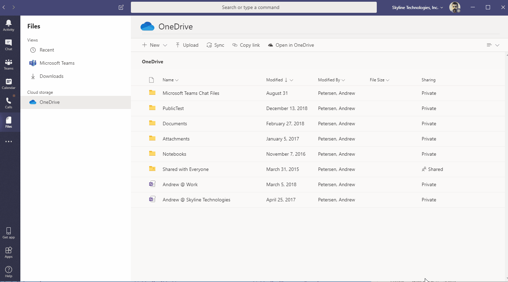

# Azure DevOps Project Finder

[https://devopsprojects.netlify.com/](https://devopsprojects.netlify.com/)

This is a Microsoft Teams App (Personal Tab) as well as a standalone web app.

This project uses my current favorites...

- TypeScript
- React
- @reach/router
- Parcel
- Netlify Hosting
- Emotion CSS-in-JS

It also uses some tools specific to Microsoft 365 development

- Fluent React / Stardust
- MSAL.js
- @microsoft/teams-js



## Microsoft Teams Development

It's kind of a pain in the butt to handle supporting both standalone app and an app that runs inside of a Teams Tab.

Issues

- keeping track of whether you have a teamsContext or not
- MSAL.js is great for Azure AD auth on your standalone app. However because Teams Tabs are IFrames, you can't use MSAL.js in the easy "redirect" way you can on a standalone app.

## Developing

- To develop locally with hot-reloading run `npm run start`
- The `/static` folder contents gets copied into `/dist` at build. You might not even need it though.

## Deploy it

- First it will create a production build
- If you haven't logged into `netlify-cli` yet, a browser window will open so you can authorize Netlify to deploy for you.
- If it is your first time deploying this project, the Netlify CLI will walk you through setting up a new site.

```sh
npm run deploy
```
